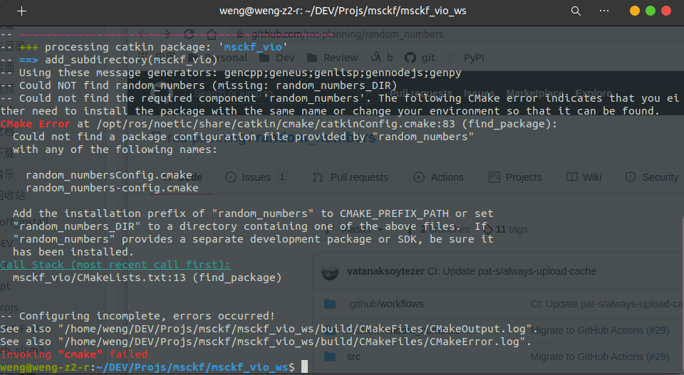

# usage


# compile
```bash
# sudo apt-get install libsuitesparse-dev
cd path_to_workspace/msckf_vio_ws
catkin_make --pkg msckf_vio --cmake-args -DCMAKE_BUILD_TYPE=Release
```


## 1. error of `random_numbersConfig.cmake`


解決

https://github.com/ros-planning/random_numbers 
下載，並將ros包放到msckf_vio_ws下的src下。